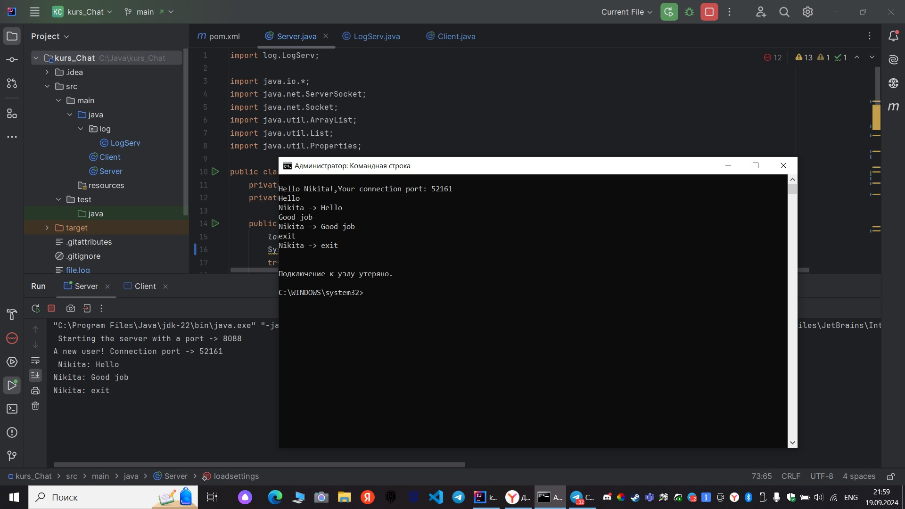
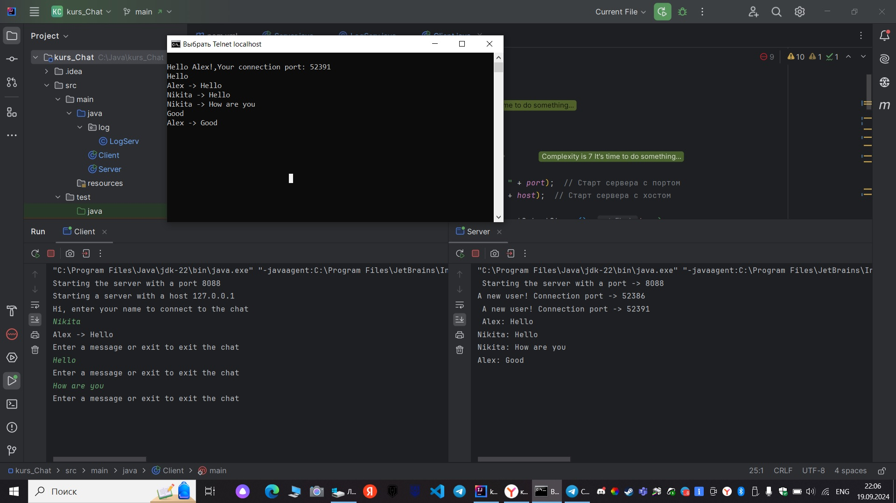

# Курсовой проект "Сетевой чат"

## Описание проекта

Вам нужно разработать два приложения для обмена текстовыми сообщениями по сети с помощью консоли (терминала) между двумя и более пользователями.

**Первое приложение - сервер чата**, должно ожидать подключения пользователей.

**Второе приложение - клиент чата**, подключается к серверу чата и осуществляет доставку и получение новых сообщений.

Все сообщения должны записываться в file.log как на сервере, так и на клиентах. File.log должен дополняться при каждом запуске, а также при отправленном или полученном сообщении. Выход из чата должен быть осуществлен по команде exit.

## Требования к серверу

- Установка порта для подключения клиентов через файл настроек (например, settings.txt);
- Возможность подключиться к серверу в любой момент и присоединиться к чату;
- Отправка новых сообщений клиентам;
- Запись всех отправленных через сервер сообщений с указанием имени пользователя и времени отправки.

## Требования к клиенту

- Выбор имени для участия в чате;
- Прочитать настройки приложения из файла настроек - например, номер порта сервера;
- Подключение к указанному в настройках серверу;
- Для выхода из чата нужно набрать команду выхода - “/exit”;
- Каждое сообщение участников должно записываться в текстовый файл - файл логирования. При каждом запуске приложения файл должен дополняться.

## Требования в реализации

- Сервер должен уметь одновременно ожидать новых пользователей и обрабатывать поступающие сообщения от пользователей;
- Использован сборщик пакетов gradle/maven;
- Код размещен на github;
- Код покрыт unit-тестами.

## Шаги реализации:

1. Нарисовать схему приложений;
2. Описать архитектуру приложений (сколько потоков за что отвечают, придумать протокол обмена сообщениями между приложениями);
3. Создать репозиторий проекта на github;
4. Написать сервер;
5. Провести интеграционный тест сервера, например с помощью telnet;
6. Написать клиент;
7. Провести интеграционный тест сервера и клиента;
8. Протестировать сервер при подключении нескольких клиентов;
9. Написать README.md к проекту;
10. Отправить на проверку.

# Описание предоставленного решения к проекту
## [Сервер](https://github.com/Nikitastolyarow/kurs_Chat/blob/705b48b5dcfb1a3253e27dd1a10650fd1f72c362/src/main/java/Server.java#L10)
### Функциональность:
- Обрабатывает множественные подключения клиентов одновременно.
- Возвращает приветственное сообщение каждому новому клиенту.
- Ведет журнал действий пользователей через `LogServ`.
- [mailing](https://github.com/Nikitastolyarow/kurs_Chat/blob/705b48b5dcfb1a3253e27dd1a10650fd1f72c362/src/main/java/Server.java#L77). Рассылает полученное сообщение всем подключенным клиентам.
- [loadsettings](https://github.com/Nikitastolyarow/kurs_Chat/blob/705b48b5dcfb1a3253e27dd1a10650fd1f72c362/src/main/java/Server.java#L66).Загружает настройки сервера из файла settings.txt.

## [Клиент](https://github.com/Nikitastolyarow/kurs_Chat/blob/705b48b5dcfb1a3253e27dd1a10650fd1f72c362/src/main/java/Client.java#L8)

### Функциональность
- Подключается к серверу, используя хост и порт из файла настроек.
- Позволяет пользователю вводить свое имя и отправлять сообщения в чат.
- Обрабатывает ввод сообщений и отображает их на экране.
- Возможность выхода из чата командой `exit`.
-  [loadsettings](https://github.com/Nikitastolyarow/kurs_Chat/blob/705b48b5dcfb1a3253e27dd1a10650fd1f72c362/src/main/java/Client.java#L40).Загружает настройки сервера из файла settings.txt.

## [Логирование](https://github.com/Nikitastolyarow/kurs_Chat/blob/705b48b5dcfb1a3253e27dd1a10650fd1f72c362/src/main/java/log/LogServ.java#L1)

Логирование действий пользователей осуществляется с использованием класса [LogServ](https://github.com/Nikitastolyarow/kurs_Chat/blob/705b48b5dcfb1a3253e27dd1a10650fd1f72c362/src/main/java/log/LogServ.java#L9). Можно модифицировать эту часть кода для настройки логирования по нужным требованиям.

## Тесты

## Интеграционный тест сервера, с помощью telnet

## Интеграционный тест сервера и клиента

## Тест сервера при подключении нескольких клиентов

